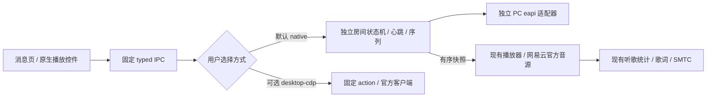
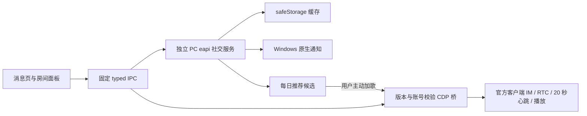
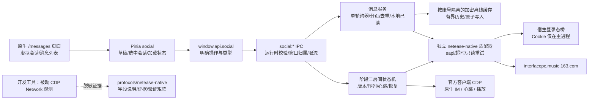
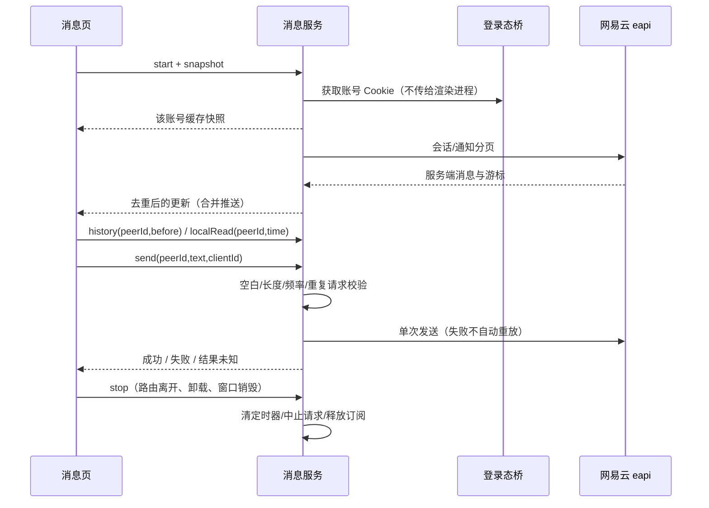
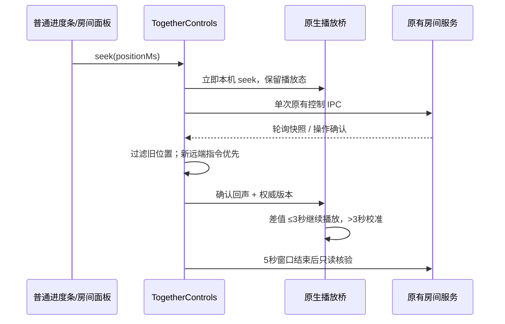

# 消息通知与一起听模块设计

日期：2026-10-04。当前基线：SPlayer-Next `4c60335d092ddd034bbf013f2fb2be938fb1e998`（dev / nightly，官方 nightly.922）；在原 e2f0ce2 迁移版基础上适配最新音频与更新器。派生源码继续采用 AGPL-3.0。当前界面、跨端接口与验证边界见 [本轮迭代](./iteration-2026-10-04.md)；旧包说明保留为阶段记录。

## 独立模式与可选客户端模式

默认 `native`：SPlayer 主进程直接使用 PC eapi 维护房间、20 秒心跳和 2 秒队列/指令拉取，渲染进程复用现有播放器、歌词、SMTC 和听歌统计。`desktop-cdp` 为用户主动选择的兼容方式，官方客户端负责音频与 IM。两种方式禁止自动互相切换；房间存续期间禁止切换方式，避免重复心跳和重复音频。独立模式不打开、连接或启动 cloudmusic.exe。

只读实测已确认 `/status/get` 的 roomInfo、`/sync/playlist/get` 的 displayList、版本向量和 playCommand/serverSeq。队列响应还包含 `rcmdSongIds`，可作为服务端提供的房间推荐候选；每日推荐作为无房间推荐时的候选，不自动覆盖队列。独立创建/加入后须验证房间可加入、心跳 result 和双端指令；HTTP 200 不等于完整功能已通过。WS 认证/ACK/续传仍缺证据，不引入未经验证的私有长连接。

接口扩展：TogetherSnapshot 携带 `mode / playbackOwned / commandSeq / playbackRevision / playMode / recommendations`；页面卸载仅取消 UI 订阅，独立模式已加入的房间由应用维持，退出房间、账号退出或应用退出才终止。播放控制仅允许房间中的网易云 songId，接收远端指令不回发，拒绝过期 serverSeq。恢复只读实际状态，不重放结果未知的发送、邀请或控制。原生播放记录走已有统计链，不能再由 CDP 观察统计重复记账。

以下保留官方客户端联调证据；独立模式验证单独记载。

## 官方客户端方案的已验证接口

Windows 官方客户端 3.1.40.205461 / `app.chunk.d4d4312.js` 已通过双账号实机验证：私信回发、接受邀请、双方加入，以及移动端和桌面端双向切歌、暂停、拖动进度。这是前期官方客户端路径的证据；后续 SPlayer 独立实现及页面接入已完成，见本轮与独立验证记录。邀请是 type 23 通用卡片，纯文本是 type 6。房间依赖原生 Yunxin IM 和 RTC 初始化，20 秒心跳由官方客户端负责。

可选 CDP 模式为 **官方客户端播放，SPlayer 提供消息、房间面板与固定操作**。进入房间时暂停 SPlayer 本地引擎，避免重复音频。客户端账号必须等于 SPlayer 登录账号；只支持已验证构建，版本不匹配只读失败，不尝试任意内部 action。用户选择 cloudmusic.exe，连接已开启的本机 9229；应用不会自动重启官方客户端。

`window.api.together` 提供 `connect / stop / create / invite(peerId) / invitationLink / replace(expectedRoomId) / takeOver(expectedRoomId) / closeExternal(expectedRoomId) / joinLink / accept(peerId,messageId) / leave / control / recommendations / add`，不接收 JavaScript、调试 URL 或任意 action。`control` 仅允许 pause、resume、next、previous、seek（毫秒）与 goto（已在队列的网易云 songId）。每次操作检查账号与预期房间，写操作不自动重发。1 秒状态拉取仅发生在可见页面；卸载释放 CDP、定时器，官方客户端继续维持房间，重新打开后重新读取实际状态。

个性化歌曲来自官方客户端使用的 `/api/v3/discovery/recommend/songs`，由本模块独立 PC eapi 读取，仅作为**当前账号每日推荐候选**，不声称是双方共同偏好推荐。候选与房间队列分开，用 songId 去重，用户主动加歌时由官方客户端处理权限和版本向量。禁止把私人 FM 自动填入房间，禁止用推荐刷新覆盖现有队列。后续独立读取已确认队列响应的 rcmdSongIds；具体生成语义仍待核实，独立模式优先采用这些候选。

Windows 通知采用 Electron 原生 Notification；首次刷新仅建立基线，后台新未读才弹出，邀请可接受或在本机忽略。后台订阅独立于页面、10 秒轮询；页面卸载只释放页面订阅，退出账号/禁用通知/退出应用终止后台资源。通知不显示私信正文，不通过后台读取历史触发已读。失效通知只打开消息页，不能自动接受旧房间。

## 事实核查与复用决策

| 来源                                                                                                                            | 查证结果                                                                                                                                 | 本项目决策                                                                                                                       |
| ------------------------------------------------------------------------------------------------------------------------------- | ---------------------------------------------------------------------------------------------------------------------------------------- | -------------------------------------------------------------------------------------------------------------------------------- |
| [SPlayer-Next](https://github.com/SPlayer-Dev/SPlayer-Next) 的 `docs/plugins/control.md`、`shared/types/plugin.ts`              | 隔离插件可订阅曲目、播放状态并控制播放；没有原生侧边栏页面注册或宿主账号权限。当前 UI 是自有 S 组件 + reka-ui + UnoCSS，没有 Naïve UI    | 原生页面 + 最小 typed IPC；复用 SButton、SInput、SVirtualList、主题和播放器。以后可增加经过授权的窄插件接口，不向沙箱提供 Cookie |
| [tacel-chat](https://registry.npmjs.org/tacel-chat/1.2.0)                                                                       | npm 1.2.0，ISC，原生 JS/DOM 模块，指向 Tacel-ltd/Modules/chat-module；GitHub 搜索没有找到可公开复用源码仓库                              | 仅参考左右布局、destroy、刷新策略；不引入整套 DOM/CSS，也不把 npm 声明视作已验证质量                                             |
| [nim-uikit-electron](https://github.com/netease-kit/nim-uikit-electron)                                                         | 基于网易云信 NIM SDK；网易云信和网易云音乐不是同一 IM 后端                                                                               | 参考组件职责，不引入 NIM 账号、传输层或 SDK                                                                                      |
| [Hyk260/PureChat](https://github.com/Hyk260/PureChat)                                                                           | Vue/Electron 的旧版聊天项目，页面声明新维护项目已迁移                                                                                    | 参考结构，不能直接替换宿主 UI 或提供网易云音乐协议                                                                               |
| [netease-listen-together-mcp](https://github.com/zbqbbm/netease-listen-together-mcp) `224bc3d8f22a98717338769d0f7704055a0f85cc` | MIT；CDP 已验证环境是 macOS 3.1.8，不是 Windows；HTTP 路线可接受现有邀请、更新列表/切歌，README 明确说无法单靠 HTTP 创建并维持可加入房间 | 参考协议字段和状态机；Windows action 和房间激活必须另行验证。不能承诺直接复制就能完整一起听                                      |
| [QListenTogether](https://github.com/s12mmm3/QListenTogether)                                                                   | Qt/QML + Qt 网易云 API，MIT；有主机/从机模式                                                                                             | 参考主从状态设计，不能直接复用 Vue 组件，也不证明当前 Windows WS 可用                                                            |
| [api-enhanced](https://github.com/NeteaseCloudMusicApiEnhanced/api-enhanced) `a8c781fd64faab17fedfd46e0615a2609307f163`         | MIT；msg_private/history/notices/forwards 的封装指定 weapi，send_text 和多项一起听接口使用默认客户端请求模式                             | 只参考 endpoint、参数和响应语义；消息读取映射到 eapi 是实验适配，须实机验证，绝不暗中回退 weapi                                  |
| [xgxdmx/NeteaseMusic-API](https://github.com/xgxdmx/NeteaseMusic-API)                                                           | 实际存在的维护分支                                                                                                                       | 作为交叉参考，不新增服务器依赖                                                                                                   |
| ncm-api-clawer                                                                                                                  | GitHub 精确名称未找到；npm 搜索噪声很大                                                                                                  | 没有确认源码、许可和能力前不采用                                                                                                 |
| [cmhook](https://github.com/justsoso17/cmhook)                                                                                  | Android LSPosed 协议观测模块                                                                                                             | 仅作观测方法参考，不能视为 Windows 协议证据                                                                                      |

表中“参考”不代表复制代码。网络格式若改写自 MIT 实现，保留 THIRD_PARTY_NOTICES 中的来源及许可。

## 架构与边界

新模块不注册到 `apis:call`，不往 `electron/main/apis/netease/modules` 加私信、房间或跨端接口。网络实现位于 `electron/main/services/social/netease-native/`；跨进程类型位于 `shared/types/social.ts`；文档和协议证据分别位于 `docs/social/` 和 `protocols/netease-native/`。只共享宿主登录态与代理桥。旧播放日志的 relay/weapi 实验已移除；打卡沿用原路径，跨端续播独立通过 `crossDevice:*` 接口实现。

## 协议选择

主路线采用独立 eapi 客户端适配，使用 `/api/...` 路径参与签名，实际请求 `/eapi/...`，表单为 `params=<密文>`。JSON 业务体包含 PC header、CSRF 与 e_r=false。不会把文档里的明文 HTTP 表单误称为 eapi。Cookie/CSRF 从当前宿主 session 取得；仅更新允许的服务端 Cookie，账号切换或退出时中止旧请求，避免旧响应污染新账号。

CDP 用于确认 Windows 客户端 action、HTTP 参数及 WS 活动。9229 只是候选调试端口，不是固定协议约定；只连接已启动的 loopback 调试目标，不自动替换/重启用户客户端。CDP 的 WebSocket 是调试传输，不等于网易云 IM 推送通道。现有参考中未发现足以实现 Windows IM WS 的握手、认证、帧格式、ACK 和续传证据，因此生产中先用有界轮询。若被动观测能获得这些要素及脱敏样本，再判断实现成本，不能凭一个 wss 地址宣称完成逆向。

## 数据流与接口

公开接口使用 `SocialResult<T> = {ok:true,data:T} | {ok:false,error:string}`。实体 ID 使用字符串，时间统一为毫秒。所有 main IPC 输入进行运行时校验，不能只相信 TypeScript。

| 操作                         | 输入                       | 输出/行为                                                               |
| ---------------------------- | -------------------------- | ----------------------------------------------------------------------- |
| `start()` / `stop()`         | 当前渲染窗口               | 启停页面订阅；重复 start 不叠加定时器，关闭窗口自动 stop                |
| `snapshot()` / `refresh()`   | 无凭证参数                 | 账号缓存/刷新快照，会话列表与通知分离                                   |
| `conversations(offset)`      | 非负 offset                | 每页 30，支持拉取更多；集合有界                                         |
| `history(peerId,before)`     | 数字用户 ID、毫秒游标      | 每页 30，按服务端 ID 去重，支持向上翻页                                 |
| `send(peerId,text,clientId)` | trim 后 1..500 字符、UUID  | 一次网络提交；全账号 1 秒间隔且每分钟最多 20 次，重复 UUID 返回同一结果 |
| `localRead(peerId,time)`     | 可见消息最大时间           | 更新本机已读水位；未证实的远端回执不发送、不显示“对方已读”              |
| `notifications(kind,cursor)` | notice / mention / comment | 分页；已读水位同样只代表本机浏览                                        |
| `onUpdate(callback)`         | 明确回调                   | 返回取消函数；合并重复快照，页面退出释放                                |

消息内容采用结构化 text / invite / unsupported。对 JSON 和邀请 URL 设置大小、字段、域名与 ID 校验；用 Vue 文本插值，不渲染任意 HTML；未知类型保留提示。邀请需要原生消息样本证明其字段，未经证实的结构不伪装成可用官方卡片。

## 性能、恢复与账号边界

- 会话与聊天内容均复用 SVirtualList；消息按真实动态高度测量。加载旧历史时按原首条 ID 保留滚动锚点；在底部时自动跟随，否则显示新消息按钮。
- 可见页面每 5 秒一次轮询（会话 + 当前会话）；隐藏页面停止当前聊天历史轮询；显式后台通知订阅每 10 秒仅拉会话，返回页面立即追赶。一个服务只有一个 in-flight 周期。错误指数退避至 60 秒，手动刷新合并在途请求。
- 网络只读最多重试 3 次；发送、接受/拒绝、创建/退出/控制都不自动重试。超时后的发送显示“结果未知”，刷新历史核实，不自动重复发消息。
- 每批 IPC 最多一个更新，数据有界；最大 500 会话、20 个已打开会话各 500 条、200 条通知，缓存总明文最大 2 MiB。达到内存上限时淘汰最旧历史，后续可重新分页。
- 离线缓存按账号隔离并用 safeStorage 加密/原子落盘；系统加密不可用时仅保留内存。退出登录清内存和本账号缓存，登录 token 刷新不会误切换账号。
- IPC 校验来源为宿主主窗口；阻止歌词窗口/外部 frame 调用账号操作。主进程退出时同步停止服务；卸载/KeepAlive 停用/窗口销毁时释放订阅、AbortController、定时器。
- 实测读取历史后未读归零，应按有服务器已读副作用处理；后台通知禁止取历史。UI 的“本机已读”与原生“对方已读”能力分别表达，不能混用。

## 阶段二当前实现和后续方向

阶段一的实际回发、卡片和加入测试通过后接入双模式；接口定义以 shared/types/together.ts 为准。默认独立模式处理 clientSeq/serverSeq、用户 version vector、心跳与回声抑制，使用宿主播放器。可选 CDP 模式仅派发固定动作，由官方客户端维护原生 IM/RTC/心跳。

主进程校验登录账号、消息来源和邀请时效；动作前检查预期 roomId，未知结果不重发；停止/账号更换递增 epoch，旧响应不能回写；读取回包按发起序号避免较旧状态覆盖新状态。连接只读恢复有退避，版本或账号不匹配停止。

个性化推荐和播放范围见开头的双模式决策。独立模式沿用原生播放器实际音频的统计链，页面卸载不停止房间，不增加第二个计数器。CDP 模式使用 createPlayProgress 累计可见且连接的观察墙钟，写入同一 play_history，不重复网易云打卡。HTTP 独立加入已在官方客户端关闭时通过；完整 IM/WS 的认证、ACK 和续传仍需证据，不能将 HTTP 功能覆盖等同于完整私有协议复刻。

设置导航：消息设置在快捷键和网络与服务之间；播放过渡、一起听歌、听歌打卡依次排列。消息设置管理后台通知，一起听设置管理实现方式与可选客户端路径。统计复用原软件，不另建“房间统计”数据库。

## 进度拖动与确认回声

本轮修复仅修改渲染层，不改变 eapi、commandInfo、clientSeq、serverSeq 或队列协议。观察到的 Windows 客户端在发出请求前记录本机操作，并用 5 秒窗口过滤同一控制的回声；SPlayer 采用相同的回声窗口，音频继续由本机引擎播放。

`publish(snapshot, localSeek?, seekEcho?)` 是渲染层内部接口，后两项不经网络传输。乐观位置与权威快照分开，不能伪造协议序列。匹配本机操作的确认回声不因 playbackRevision 更新而重复 seek；新远端拖动、切歌和暂停仍按权威序列应用。切歌不预先猜测目标，仍遵循主进程 ORDER_LOOP / RANDOM 队列。

资源回收：引擎目标保护最多 1.5 秒；本机回声保护 5 秒；控制 IPC 等待最多 15 秒。确认、失败、卸载、房间变化、账号退出和应用销毁均清理对应定时器或使迟到响应失效。超时只读核验，不重发控制；读取失败不拿旧缓存强制回跳。原生 seek 与 HTTP 回执并发完成时只消费一次本机跳转，实际偏差超过 3 秒才再次校准。

## 验收

代码层：node/web 类型检查、ESLint、协议编解码/重试/发送去重/分页合并/退出竞态/账号切换测试、渲染测试及生产打包。

实机层：Windows 官方客户端版本固定；用本人账号确认会话、通知及历史响应；专用测试账号验证发送、回执和原生邀请；断网/重连/切换账号/退出；10,000 条列表数据下检查 DOM 数量和滚动；采集启动 60 秒与运行 10 分钟的内存样本（与基线对比）。服务端成功码、代码测试和实际两端同步分别记录。
