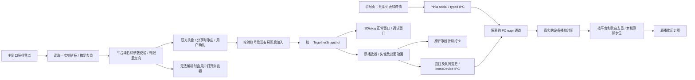

# 2026-10-04 交互与跨端功能迭代

当前源码基线为 SPlayer-Next dev `4c60335d092ddd034bbf013f2fb2be938fb1e998`（官方 nightly.922）。本轮已核对 origin/dev，与该提交一致。此前输出的 setup、源码 ZIP 和 patch 是较早的阶段产物，**不包含本文件中的全部改动**；按照用户要求，全部任务完成后才重新生成安装包。本轮只编译应用代码，没有运行安装器或覆盖真实安装。

## 设计与实施顺序

先处理消息请求、账号隔离和滚动锚点，再整理一起听窗口及播放栏，随后接入已核验的跨端与分享协议。最后补充资源卡片、验证与文档，安装包放在最后。渲染界面只消费 typed 快照，不直接管理 Cookie、协议签名或官方客户端调试表达式。

正常一起听窗口复用 SDialog，宽 480px、高不超过 620px。无房间时显示好友邀请及创建后复制；已有外部房间时显示接管、关闭；本机已加入时显示成员、当前歌曲、房间歌单、推荐来源和离开，不增加进度或控制面板。原调试界面保留在消息页右上角。关闭小窗仅释放小窗资源，已加入房间仍由应用维持。

底栏一起听按钮位于清晰度和音量之间；三点菜单在入房后显示“离开一起听歌”。头像显示分别由播放栏、全屏两个设置开关控制。等待时头像分开，受邀方灰化并显示加载点；加入后播放栏重叠、全屏向中间靠拢。封面、成员区和文字使用同一布局参照与 CSS 动画曲线，中途状态变化从当前位置转向新目标。隐藏窗口暂停加载动画，退出时保留旧头像直到淡出；没有新增听歌计时器、轮询器或常驻 RAF。

## 本轮完成的修改

- 消息页采用原有标题和 STabs；四类消息共用右侧详情。搜索会话、聊天 UID 输入和刷新按钮已移除，诊断入口不挤占主布局。错误显示在标题侧边，区分读取忙碌与发送限流。
- SCard 工作区、列表和页签继承同一主题背景、边框与圆角；修正浏览器默认边框导致的额外边线。页签与左侧列表之间移除横线，页签作为局部覆盖层，滚动条目从下方经过；上浓下淡的主题渐变和 10px 背景模糊仅限列表顶部约 64px，渐变尾部不拦截点击或滚动。初始 48px 留白复用 SVirtualList 的 paddingTop，没有额外滚动监听或逐项模糊。聊天输入底部与列表底部对齐，发送按钮和字数位于输入框右下。
- 纯文字气泡按实际内容收缩；时间、发送状态放在气泡外侧，长文本和无空格长串可换行。合成数据中两个中文字的气泡约 58px，六字约 122px，不再被时间文本撑宽。
- 会话及消息都使用虚拟列表。首次进入贴底，用户向上滚动后保留阅读位置；前插历史、图片改变高度时保持消息 ID 与像素锚点，贴底用户才自动跟随新消息。已测量高度只保留当前有界集合。
- 双方头像复用 SocialAvatar，先解码新图片再替换已显示图片；同一资源的参数变化不重新淡入，过期加载及卸载回调失效。消息、房间成员和播放栏共用此处理。
- 适配歌曲、专辑、歌手、歌单、播客节目、电台、图片、MV、动态、用户和已核验的一起听邀请。资源卡片使用受控字段和 HTTPS 地址，歌曲复用原播放器；未知载荷保留安全预览。消息邀请卡已移除“在本机忽略”，未伪造远端拒绝或对方已读。
- 邀请支持最近会话及任意合法好友 UID。独立模式房主通过 `/api/middle/shorturl/generate` 生成 `163cn.tv` 官方短链，失败回退受控 H5 链接；复制文案附 `@Splayer` 加零宽字符的来源标记。标记只识别来源，不视为授权或真实性证明。
- 主窗口获得焦点时只读取一次剪贴板，摘要去重；解析限制平台域名、参数、大小、跳转次数和超时。失焦、窗口销毁取消请求；旧账号和迟到结果不入房。已有房间不会因剪贴板自动退出。短链无法解析时显示浏览器按钮，成功打开后关闭小窗。
- 正常小窗的好友选择与 ID 输入、邀请与复制按钮分行排列，避免输入框被挤到零宽；推荐按钮沿用主题背景。推荐读取有独立加载状态并防止重复请求，不阻止暂停、拖动或退出。
- 歌曲原有菜单新增“添加到一起听”，可从原推荐、搜索和歌单添加新的网易云歌曲。只发送已有原生 ADD 参数，保留现有队列，读取房间列表确认后提示成功；云盘、非网易云歌曲、迟到旧房间提示均被拦截。一起听期间隐藏单曲本地“下一首播放”，其他本地插入入口也不会绕过房间同步。
- 候选选择器改为“歌曲来源”，明确“我的推荐 / 房间推荐 / 播放历史”只决定手动加歌来源。已只读识别服务端 heart 模式，但没有用个人每日推荐冒充按房主喜好自动续歌或双人口味算法；开启、关闭和会员校验请求仍待核验。
- 修复房间同步覆盖普通持久化播放队列的问题。临时房间借用原队列视图，不落盘；status 继续保存普通队列对应的索引、位置和模式。退出、注销或卸载立即恢复原队列和随机备份，取消迟到音源、歌词请求及简繁转换，不自动播放；短暂断线仍保留房间队列。期间标签修改和服务器删除正常作用于普通队列，同 ID 的不同音源不会被房间元数据覆盖。详细规格见 [队列与推荐设计](./together-queue-design.md)。
- 消息四类列表分别保存滚动位置，切换后恢复各自位置；切换器和详情布局不重建。真实浏览器合成数据验证私信 760px、评论 228px、提及 380px、通知 608px 独立恢复；换账号清空位置。
- 修复退出时 WebContents 先销毁、BrowserWindow 尚存而触发的发送崩溃。一起听状态、消息状态和通知导航在发送前检查两者；停止服务、取消请求与清理仍正常执行，没有通过吞掉全局异常掩盖错误。
- 外部房间的接管、关闭操作在用户确认后再次核对预期房间 ID；未知写入结果先只读对账。正常窗口优先显示随快照更新的房间推荐，缺少时每房间尝试一次当前账号每日推荐；可以手动重试，不把推荐读取当作队列替换。
- 跨端续播开关默认开启。读取 Windows 原生最近播放并合入原历史页；本机统计仍只计算本机真实播放。队列、曲目及模式变化使用已观察的原生 JSON 封装，没有给歌曲新增周期进度上报。关闭开关、换账号及窗口销毁取消请求并清空远端账号快照。
- 远端历史按平台、歌曲 ID、实际播放时间去重；本机删除和清空使用每账号有界水位持久化，避免下次拉取恢复已删除内容。并发加载、迟到账号响应及同曲新的播放时间分别处理。

## 接口与生命周期

| 接口                                           | 输入 / 输出                                             | 约束                                                               |
| ---------------------------------------------- | ------------------------------------------------------- | ------------------------------------------------------------------ |
| `window.api.crossDevice.refresh()`             | `CrossDeviceSnapshot { accountId, records, canResume }` | 同账号单飞，60 秒缓存，最多 300 条远端记录                         |
| `window.api.crossDevice.resume()`              | `CrossDevicePlayback { tracks, index, playMode }`       | 用户点击才领取服务端 offer；一起听期间禁止抢占播放器               |
| `window.api.crossDevice.publish(source)`       | `CrossDeviceSource { songIds, currentId, playMode }`    | 最多 1000 首；主进程核对正在播放的网易云歌曲；只保留最新待提交内容 |
| `window.api.crossDevice.cancel()`              | 无                                                      | 中止在途读取和写入，清空会话、offer、账号缓存                      |
| `window.api.together.invitationLink()`         | 平台短链或受控 H5 链接                                  | 独立模式仅房主复制邀请，等待生成期间房间变化则丢弃结果             |
| `window.api.together.takeOver / closeExternal` | `expectedRoomId`                                        | 不能操作用户确认后已经改变的房间                                   |

Cookie、设备标识和完整续播 offer 留在主进程。全部新 IPC 限定主窗口顶层 frame 并校验输入；消息读取有界单飞不影响发送保护。新建的超时、滚动测量、轮询、图像加载和监听都有对应取消或卸载路径。未知写入结果不能自动重放；跨端快照只有明确的服务端 `10001` 才按 Windows 逻辑补传一次新会话，不循环重试。

## 已验证与尚缺的证据

136 项 Node、283 项 Vitest（48 个文件）、两侧 TypeScript、修改文件 Prettier/ESLint 和 electron-vite 生产编译通过。覆盖跨端参数、明确失败后的补传、账号取消、历史删除并发、IPC 单飞、头像迟到加载、虚拟滚动锚点及页面卸载。新增自动接续覆盖重复结束、推荐耗尽、四秒等待、远端先切歌、手动操作竞态、未知写入、单曲/心动/未知模式及销毁。此前独立入房、主机建房、邀请和双方播放同步的用户实测证据继续有效，拖动平滑同步已由用户确认。

本轮对授权测试账号的原生读取得到 299 条其他设备播放记录；配置、最近播放、位置读取及曲目/队列提交均返回成功，但本次位置响应没有续播 offer，**不把接口成功当作真实跨端续播验收**。短链接口和有限重定向用不关联真实房间的示例标识验证，返回官方短链、302 和相同 H5 参数；真实房间的手机打开体验由用户验收。脱敏记录见 [本轮协议验证](../../protocols/netease-native/validation-2026-10-04.md)。

独立 QA 的 500 会话只渲染可见行；消息模拟页面约 30 分钟内主窗口 Tab 工作集从 149 MiB 到 146 MiB（中间 141 MiB），没有据此证明真实音频、房间峰值或全部场景无泄漏。真实账号长时间、网络波动及安装覆盖测试按用户要求由用户执行。

**在线状态上报尚未实现。** 已读取的 `mutualFollowSeeOnline` 是隐私字段，不能代替在线心跳；`os.isOnLine` 只表示网络连通。用户反复退出后手机仍显示在线的观察没有可对应的离线确认，不能推导真实上报协议或离线时限。需要认证、心跳/续期、服务端确认、离线撤销和重连证据后再实现默认开启的设置及生命周期，没有加入无效开关或猜测写请求。

双人口味心动推荐已读到 heart 模式及动态队列，但手机开启/关闭、普通房间歌单恢复及非会员响应仍缺证据。私有 WS 认证/ACK/续传、成功撤回、远端拒绝/已读、非空通知及安卓“一起听了 N 分钟”总结卡载荷仍缺证据。已观察的资源卡片不代表所有未知类型都完成。当前资料足以支持列出的消息与房间 HTTP 能力，不能宣称复刻了 Windows 全部私有协议。

## 最后交付与用户验收

完成待验证协议后再生成 Windows NSIS 包，沿用 appId、GUID、产品名、原安装路径及 `%APPDATA%/SPlayer-Next`；实际覆盖升级前保留现有数据备份。较早交付说明见 [阶段记录](./release-2026-10-04.md)，其中的旧安装包不可用来验收本轮新增功能。

用户重点验证：原推荐歌曲添加到一起听、房间列表同步；四类消息独立滚动；短消息与主题边框；首次贴底、上拉不跳、双方头像稳定；等待/加入/退出与快速中断动画；任意好友和短链邀请；外部房间处理及断网恢复；另一个设备播放后历史去重和删除保持；确有续播 offer 时点击续播，以及关闭开关后不再跨端上传。一并确认原播放、歌词、统计、打卡和插件行为。

第三方许可说明已纳入安装器 extraFiles，后续包会同时保留原 AGPL 许可及 MIT 来源声明；应用身份和数据目录保持原值。

macOS 工作流保存为 `.github/workflows/build-macos.yml`，目标为用户 Fork `GeekerKuan/SPlayer-Next`。默认分支注册手动工作流，`source_ref` 选择 `social-together` 源码分支；后续新增三平台安装包工作流，按最新要求先生成当前可测试版本安装包，详见 [安装包下载](./desktop-build.md)。非 Windows 平台固定使用独立一起听模式，导入 Windows CDP 设置也不会连接官方客户端。操作见 [Mac 云端构建](./macos-build.md)，执行成功前不宣称 Mac 已验证。产物未经 Developer ID 签名和公证。

## 跨设备房间接管确认

接管与冷启动恢复先发送当前服务器歌曲、状态和进度的原有心跳，再读取并核对房间。确认后才中止普通播放、绑定本机并保存恢复记录。否定响应、房间改变及停止期间的迟到结果不取得房间归属；空队列不发送虚构歌曲。房主和房员均可接管，过程不创建/退出房间，不替换歌单，不承诺服务端未核验的强制踢出另一设备。六项新增测试覆盖这些边界。

## 新建房间初始化与诊断入口调整

仅在本账号成功新建的房间中，停止引擎前保存当前可播放的网易云歌曲、实际毫秒进度和播放/暂停状态。首个已有 GOTO 携带该快照；进度限制在歌曲时长范围内，首轮心跳使用确认后的房间状态，避免已 stop 的引擎上传零进度。其他音源、私有云上传、加载/停止中的旧歌曲标签采用网易云推荐并从零播放。不增加接口、签名字段、定时器或队列持久化。接受邀请、接管和冷启动恢复始终沿用服务端状态。

实现方式与 Windows 客户端选择已从普通播放设置移至 TogetherPanel 调试窗口，复用原 SettingsItem 和持久化绑定。普通设置保留头像展示开关。房间存在或请求进行时禁用切换；Mac 始终使用独立模式。新增参数与来源保护已自动验证，真实新建房间的进度体验由用户实测，不能将旧版入房实测作为本轮证据。

## 普通队列自动推荐续歌与房员接续

播放器自然结束仍先沿用原统计与定时关闭，仅未定时关闭时通过受限 `together:ended` IPC 提交房间、歌曲和指令版本。主进程核对实际引擎 `isFinished` 后，复用房间轮询处理接续；等待期间前端保留临时队列，但不重新加载已结束歌曲。推荐自动续歌默认开启，到列表末尾增量补一首房间推荐，耗尽时使用执行账号每日推荐；原列表不替换。单曲循环、heart 和未知模式不插入个人推荐。

房主立即接续；房员先等四秒，再核对服务器歌曲和指令没有变化，由 UID 选出的房员接续。服务端成员没有可靠在线字段，不将此判断等同离线证明，不修改 creatorId，也不宣称房员能读取离线房主口味。手动操作、远端新指令、账号变化和销毁取消等待。未知 ADD 只读确认后才继续，未知 NEXT 不重放，提示可手动切歌。版本重读不能代替未经核验的跨客户端原子锁。同账号多实例并发与真实房主离线场景仍需用户验收，详见 [接续设计](./together-continuation.md)。

## 退出、续播与焦点邀请修复

退出时协议注册按 Session 复用；续播入口独立限频、已领取入口不被旧读取复活；剪贴板改为用户确认的头像/歌曲预览。前一轮三平台云端构建已成功，当前修复一起本地验证后再次构建；实际退出、重复续播及覆盖升级由用户验收。详见 [设计与验收](./lifecycle-relay-invites.md)。
