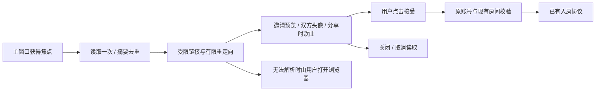

# 退出、跨端续播与邀请预览

## 实施顺序与交付边界

先处理退出时重复协议注册和窗口重建，再修复续播入口的缓存及竞态，最后接入剪贴板邀请预览。三项在本地一起验证后上传 `social-together`，统一构建 Windows x64、macOS Intel 与 Apple Silicon 安装包。手机抓包置后；耗时实机验收由用户执行。

前一轮 [Actions 构建](https://github.com/GeekerKuan/SPlayer-Next/actions/runs/37197416485) 的三个平台已成功，源提交为 `f08e48f2619b08ee123ea9fbdf0cf0a82ddc8eaf`，不包含此处修复。构建成功不等于实际 Mac 退出或保数据覆盖升级已经验收。

## Mac 退出

`cache://` 在应用 ready 时注册到默认及 `persist:main` Session。协议寿命与 Session 一致，重建窗口不会重新注册；缓存和流媒体封面注册均检查现有处理器。退出阶段的 activate 和 createMainWindow 不创建新窗口，同一主窗口只保留一个实例。协议读取、数据目录和封面路径校验沿用原实现。

## 跨端续播

历史缓存为 60 秒，续播入口单独限频 10 秒，共享在途读取；不添加后台轮询。明确 `rate-limited` 后停止该入口查询 60 秒，并在历史页显示相应文案。无法取得入口时保留历史，清除过期的续播按钮。用户可点击“检查其他设备播放”。

领取使旧入口版本失效，先前开始的读取不能重新显示已领取入口。关闭功能、换账号及销毁取消请求和旧结果。曲目、队列提交字段、歌曲 progress=0、未知写入不重放及仅明确 10001 补传一次等协议行为不变。这些修复不能证明用户观察到的第二次失败一定是服务端限流；重复真实续播仍需验收。

## 剪贴板邀请

解析成功先显示预览，不自动入房。显示本机账户和邀请人的头像；邀请人优先使用已缓存的会话资料，否则通过原项目 `user_detail_new` 的 eapi 路径 `/api/w/v1/user/detail/{id}` 和 `{all:"true",userId}` 读取。此路径来自已有封装，不将它标为新抓包确认的 PC 行为；失败使用姓名或 UID 占位。

分享 URL 的可选 songId 单独用于只读歌曲详情，**不进入接受邀请的协议参数**。文案为“邀请时的歌曲”，不将分享时的歌曲冒充房间实时歌曲。无 songId 或无法读取时明确提示，加入后使用服务器房间状态。room/check 的 joinable 为 false 时禁用接受；仍以实际入房响应确认成功。

预览总超时 8 秒；失焦、关闭小窗、换邀请、换账号、销毁取消读取并忽略迟到结果，不保留永久元数据缓存。部分资料失败不阻止用户主动接受。已有不同房间时转到当前房间管理，不能因剪贴板自动退出、替换或接管。其他弹窗打开时不抢占操作。

## 用户验收

- Mac：退出整个应用，再检查无报错；关闭并重开窗口后封面仍能读取。
- 跨端：手机播放后检查入口，领取一次，再播放另一首并检查第二次领取；区分“未提供入口”和明确限流。
- 邀请：复制官方短链或带应用标记的分享，聚焦 SPlayer；确认头像、分享时歌曲、接受与取消；重复聚焦不反复弹窗，其他房间不被替换。
- Windows 覆盖升级：安装原 setup 包到原位置，检查登录、设置、插件及数据库保留。Mac 安装器尚无签名、公证；应用身份与用户数据路径不变。

后续仍按 [剩余计划](./remaining-work.md) 保留自动接续双端验收、心动推荐切换协议、真实在线上报、消息总结/撤回/回执与 WS 认证调查。没有证据的请求不以猜测实现，全部需求完成前不执行关机。
