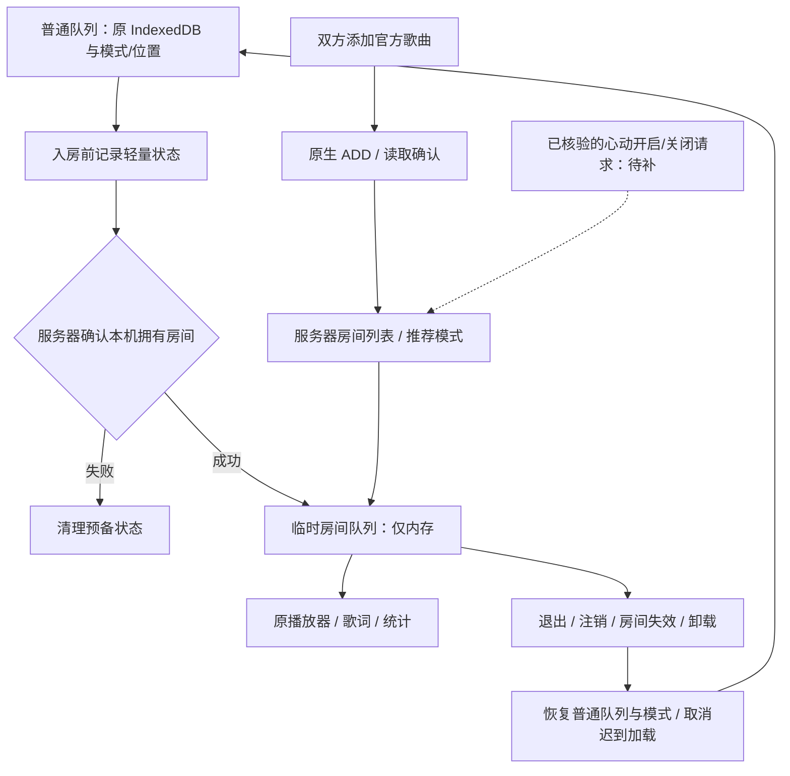

# 一起听队列与推荐模式：需求校正及实施顺序

## 校正后的需求

一起听必须使用临时房间队列，复用原播放器与统计，但不能覆盖普通播放队列、随机顺序备份、记忆位置或用户保存的歌单。房主和房员添加官方网易云歌曲后，以服务器确认的房间列表同步到两端；退出、注销、房间失效或前端订阅销毁释放房间队列，恢复入房前的普通队列和模式，保持停止状态，由用户决定继续播放。这里的“销毁”是释放临时列表和监听，播放历史、统计及用户保存的歌单继续保留。

推荐来源与房间推荐模式是两件事。“我的推荐 / 房间推荐 / 播放历史”决定手动加歌的候选来源；“心动推荐”可能改变整个房间的队列生成方式。不能因为取得本账号每日推荐，就宣称按房主喜好自动续歌；也不能把切换候选来源的选择器称为服务端模式开关。

心动推荐只在观察到官方开启、关闭请求及确认行为后接入独立控制。开启前的普通房间歌单与推荐歌单应隔离；关闭后的恢复以实际协议为准。不能在本机直接恢复旧列表却让服务器仍处于心动模式，也不能猜测“强制刷新”请求。会员要求由真实服务器结果处理，本次测试账号有会员，不能据此推断普通账号的权限。

## 已确认与待确认

| 内容                 | 当前证据 / 实现                                                                                             |
| -------------------- | ----------------------------------------------------------------------------------------------------------- |
| 房主、房员添加歌曲   | 已有原生 ADD、官方歌曲详情校验及写后读取确认；原歌曲菜单与小窗候选入口复用                                  |
| 房间同步到播放器     | 已有统一快照、命令序列、去重、官方音源限制和原播放统计链                                                    |
| 普通队列隔离         | 本轮发现旧调用会持久化房间列表，现已替换为临时队列视图                                                      |
| 正常退出与迟到加载   | 恢复原队列、模式、记忆位置；作废旧加载；不自动播放；空房间和注销同样清理                                    |
| 程序中断后的数据     | 普通队列持续保持原持久化内容；status 保存原索引、模式和位置，音量等偏好正常保存                             |
| 心动模式读取         | 服务端观察到 `listMode=heart`，已只读展示；未知模式不导致房间播放失败                                       |
| 心动推荐动态列表     | 已观察到 10 → 13 → 19 → 22 → 25 → 28 → 31 首，以及三首推荐候选的变化                                        |
| 普通队列推荐自动续歌 | 已接入 SPlayer 接续策略；末尾补一首房间推荐或执行账号每日推荐，不宣称官方口味算法                           |
| 房主无响应时接续     | 已接入四秒等待、版本重读和房员选举；使用原指令，不修改服务器房主，真实双端待用户验收                        |
| 双人口味算法         | 尚未确认生成和模式切换规则；不以个人每日推荐冒充双人口味                                                    |
| 心动开启、关闭和恢复 | 官方页面 18 次状态变化、只读队列 9 次变化；Windows CDP Network 未捕获手机开关请求，样本期间模式始终为 heart |
| 非会员限制           | 用户判断应有会员限制且本账号有会员；没有真实失败响应，尚未核验                                              |

## 队列层次与数据流

`src/stores/queue.ts` 只保留一份普通队列和随机备份引用，不复制 TrackDetail，不新建计时器。`setTemporaryQueue` 更新播放器既有队列视图而不落盘；`restoreTemporaryQueue` 恢复原视图并清空备份。迟到磁盘恢复不能替换正在显示的房间列表；期间编辑标签或删除流媒体服务器仍更新普通队列，恢复时不会带回已删除服务器歌曲。

`src/stores/status.ts` 使用原 persist 的字段集合和存储键，临时播放期间序列化普通队列对应的索引、位置与模式；不改变已有数据格式。`src/services/togetherPlayback.ts` 复用原音源加载和播放操作失效机制，在退出时立即释放列表，不等待旧音源解析完成。退出同时作废原歌词加载 token 和简繁转换 token，防止迟到内容覆盖恢复的普通歌曲；不新建取消管理器或计时器。短暂断线保留房间队列，继续只读恢复；只有退出或归属丢失才恢复普通队列。

推荐模式通过 `TogetherSnapshot.recommendationMode?: "heart"` 只读展示；不把原始 `listModeParam`、账号标识或未知写字段传到渲染进程。现有读写端点不变。

## 后续实施顺序

1. **先完成数据隔离和退出清理。** 本轮已接入临时队列，验证空列表、跨房更新、迟到磁盘读取、慢音源退出、注销/订阅销毁和原 status 持久化。
2. **保持双方加歌与播放同步。** 继续使用原生增量 ADD 和服务器列表，不写本机普通歌单，不用个人推荐替换整个房间队列。
3. **取得真正的手机开关请求。** 确认关闭入口、开关时间、模式回显、原房间队列恢复、版本向量和会员失败响应。PC 可见状态只用于交叉核对，不能代替手机出站请求。
4. **分别实现已验证的推荐模式。** 明确普通歌单、按房主喜好续歌、双人口味推荐的实际区别后再提供对应选项；按服务端确认提交或恢复，结果未知时只读对账，不重放写请求。
5. **回归并在最后打包。** 用户负责耗时真实双端、弱网和保数据覆盖升级验收；源码检查、许可和应用身份保持检查完成后，再生成 Windows 安装包。尚缺协议的在线上报继续列为未实现，全部任务未完成前不关机。

完整累积需求状态见 [需求核对表](./task-audit-2026-10-04.md)，协议证据见 [验证记录](../../protocols/netease-native/validation-2026-10-04.md)。
